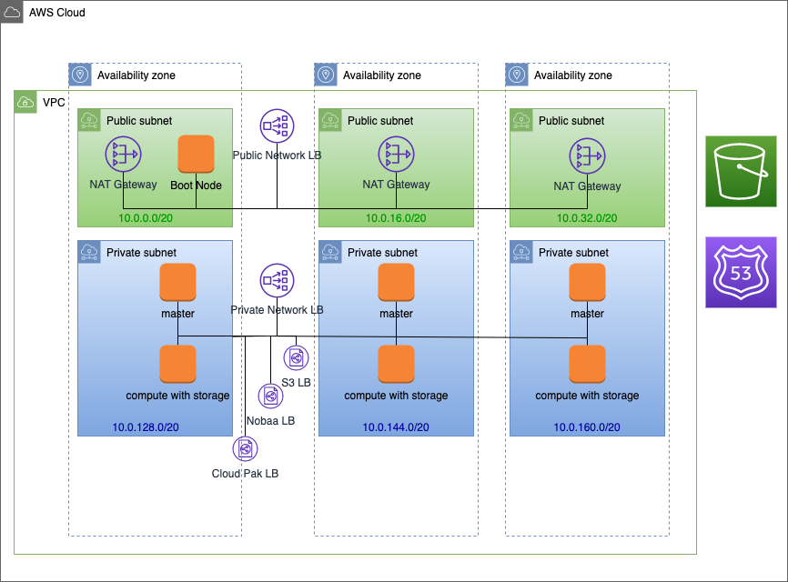

## IBM Cloud Pak for Integration on AWS
This Quick Start automatically deploys a multi-master, production instance of IBM Cloud Pak for Integration on a Red Hat OpenShift Container Platform 4.4.22 cluster on the Amazon Web Services (AWS) Cloud. The cluster is created in a new or existing virtual private cloud (VPC) on Red Hat CoreOS instances. The standard deployment takes about 2 hours.

IBM Cloud Pak for Integration brings together IBM's market-leading integration capabilities to support a broad range of integration styles and use cases as part of your journey to the cloud. It provides a simple, complete solution that enables clients to leverage the latest agile integration practices, simplify the management of their integration architecture, and reduce cost while driving digital transformation across their organizations.

The Cloud Pak includes the following capabilities to meet all your integration needs, delivered as a single integrated platform that works seamlessly together in production:  

**API Lifecycle Management** - Create, secure, publish, discover and manage APIs across clouds while you maintain continuous availability. Take control of your API ecosystem and drive digital business with a robust API strategy that can meet the changing needs of your users.

**Application and Data Integration** - Integrate all of your business data and applications more quickly and easily across any cloud, from the simplest SaaS application to the most complex systems — without worrying about mismatched sources, formats or standards.

**Messaging** - Simplify, accelerate and facilitate the reliable exchange of data with a flexible and security-rich messaging solution that's trusted by some of the world's most successful enterprises. Ensure you receive the information you need, when you need it — and receive it only once.

**Event Streams** - Use Apache Kafka to deliver messages more easily and reliably and to react to events in real time. Provide more engaging customer experiences by responding to events before the moment passes.

**Secure Gateway** - Create persistent, security-rich connections between your on-premises and cloud environments. Quickly set up and manage gateways, control access on a per-resource basis, configure TLS encryption and mutual authentication, and monitor all of your traffic.

**High Speed Data Transfer** - Send large files and data sets virtually anywhere, reliably, and at maximum speed. Accelerate collaboration and meet the demands of complex global teams, without compromising performance or security.

**Operations Dashboard** - Enable cross-component transaction tracing to allow troubleshooting and investigating errors and latency issues across integration capabilities.

**Cloud Pak for Integration** uses AWS services and features, including virtual private clouds (VPCs), Availability Zones, security groups, and Elastic Load Balancing to build a reliable and scalable cloud platform.

This reference deployment provides AWS CloudFormation templates to deploy Cloud Pak for Integration on a new OpenShift cluster. This cluster includes:

A Red Hat OpenShift Container Platform cluster created in a new or existing VPC on Red Hat CoreOS (RHCOS) instances, using the Red Hat OpenShift Installer Provisioned Infrastructure. See the OpenShift Container Platform Installation overview for details about the underlying OpenShift deployment architecture.

A highly available storage infrastructure with Red Hat OpenShift Container Storage.

Scalable OpenShift compute nodes for running Cloud Pak for Integration capabilities.

For more information about Cloud Pak for Integration, see the IBM Knowledge Center.

IBM Cloud Pak for Integration can use AWS services and features, including VPCs, Availability Zones, security groups, Amazon Elastic File System (Amazon EFS) or Openshift Container Storage (OCS) or Portworx  as storage and Elastic Load Balancing to build a reliable and scalable cloud platform.

For architectural details, best practices, step-by-step instructions, and customization options, see the [deployment guide](https://fwd.aws/AYp9v).

To post feedback, submit feature ideas, or report bugs, use the **Issues** section of this GitHub repo.
If you'd like to submit code for this Quick Start, please review the [AWS Quick Start Contributor's Kit](https://aws-quickstart.github.io/).
